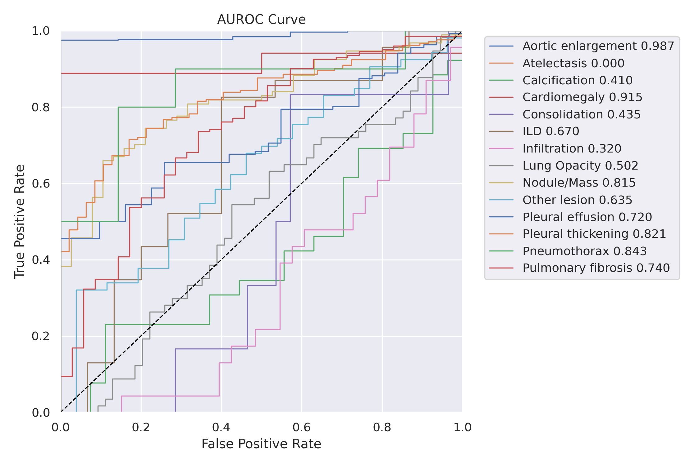

# YOLOv5 AUROC Extension

This repository contains an enhancement of the YOLOv5 object detection framework to incorporate the calculation of the Area Under the Receiver Operating Characteristic curve (AUROC) per class, which plays a crucial role in evaluating model performance, especially in the domain of medical imaging.

## Importance of AUROC in Medical Imaging

In the realm of medical imaging, the assessment of model predictions is paramount due to the high stakes involved in clinical applications. AUROC is a widely utilized metric in this field as it provides a comprehensive measure to evaluate the discriminative ability of the model across different classes without being affected by the class imbalance. It provides insights into how well the model can distinguish between classes and gives a single score that summarizes the ROC curve, which plots the true positive rate against the false positive rate at various threshold settings.

## Modifications Made

The following files have been modified to incorporate AUROC calculations and visualizations into the YOLOv5 framework:

- `metrics.py`
- `val.py`
- `train.py`
- `__init__.py`

## Detailed Explanation on AUROC Calculation

### Process Batch: `process_batch(self, detections, labels)`

The `process_batch` method in the `AUROC` class is pivotal in accumulating data required to compute the AUROC for each class. Given below is a simplified walkthrough of how this method processes detection and label data for AUROC computation.

#### Parameters:
- `detections`: A batch of detected bounding boxes with shape \([N, 6]\), where \(N\) is the number of detections. Each detection is represented as \([x_1, y_1, x_2, y_2, \text{confidence}, \text{class\_id}]\).
- `labels`: A batch of ground truth labels with shape \([M, 5]\), where \(M\) is the number of ground truths. Each label is represented as \([\text{class\_id}, x_1, y_1, x_2, y_2]\).

#### Workflow:
1. **Filtering Detections**: Detections are filtered based on a confidence threshold to reduce false positives.
   
2. **IoU Calculation**: The Intersection over Union (IoU) between all ground truth boxes and detected boxes is calculated using the `box_iou` method. This step helps to find matches between predicted boxes and ground truth.

3. **Matching Detections with Ground Truth**: 
    - Matches between detections and ground truth are found based on IoU and a predefined IoU threshold.
    - Matches are identified and organized to ensure that each ground truth is matched with the detection that has the highest IoU.
    - A detection is considered a True Positive if it is matched with a ground truth of the same class, otherwise, it is considered a False Positive.

4. **Accumulating Predictions and Ground Truth**:
    - For each class, the confidence score of detections (True Positive or False Positive) is stored in `self.pred[class_id]` as prediction scores.
    - Correspondingly, `1`s (for True Positives) or `0`s (for False Positives) are stored in `self.true[class_id]` as ground truth labels.

### Subsequent AUROC Calculation:

After processing all batches through `process_batch`, the predictions and ground truth accumulated in `self.pred` and `self.true` respectively, are utilized to compute the AUROC score per class using the `roc_auc_score` method from Scikit-learn, which can be triggered using the `out()` method in the `AUROC` class.

This calculated AUROC can then be visualized and analyzed to comprehend the performance of the model for different classes, especially vital in imbalanced datasets, where per-class performance evaluation is crucial.

## Usage

Ensure that the modifications are properly integrated into your YOLOv5 setup. During training or validation, the AUROC per class, as well as relevant curves, should be computed and can be visualized for detailed model performance analysis.

In LOG, will update mAUC value at each validation epoch. Then added a new AUC column at the end of the training.

```
      Epoch    GPU_mem   box_loss   obj_loss   cls_loss  Instances       Size
       1/99      4.64G    0.04494    0.06671    0.01729        301        640: 100%|██████████| 8/8 [00:21<00:00,  2.70s/it]
                 Class     Images  Instances          P          R      mAP50   mAP50-95       mAUC: 100%|██████████| 4/4 [00:10<00:00,  2.51s/it]
                   all        128        929      0.709      0.276       0.31      0.206     0.0534
```

```
Model summary: 157 layers, 7225885 parameters, 0 gradients, 16.4 GFLOPs
                 Class     Images  Instances          P          R      mAP50   mAP50-95       mAUC: 100%|██████████| 4/4 [00:09<00:00,  2.38s/it]
                   all        128        929      0.679      0.258      0.305      0.201     0.0618
                person        128        254      0.847      0.354      0.411      0.254      0.947
               bicycle        128          6      0.789      0.631      0.673      0.391          0
                   car        128         46      0.604      0.283      0.402       0.16          0
            motorcycle        128          5      0.488        0.2      0.203      0.183          0
...
...
...
```

### Integration with Weights and Biases (WandB)

The modified code allows for tracking the AUROC scores for each class on Weights and Biases (WandB) during the training phase. This aids in the real-time monitoring of model performance across different classes. Moreover, upon the completion of training, AUROC curves and radar charts will be generated and saved, providing a visual representation of the model's discriminative ability across classes.

When the training is complete, we will generate a polar_chart figure of AUC and a auroc_curve figure.
Taking the vindr CXR dataset as an example, the results of the two figures are:



At the same time, during experiment uses wandb, and the ROC change curve of each class will be update during training.


## Acknowledgements

- The original YOLOv5 repository and contributors for the robust object detection framework.
- [Scikit-learn](https://scikit-learn.org/stable/) for providing efficient tools for data mining and data analysis.

## License

This project is licensed under the AGPL-3.0 License - see the [LICENSE](LICENSE) file for details.


